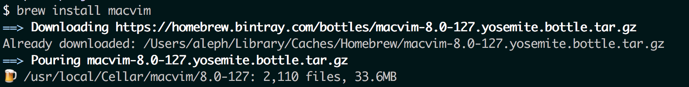

# Installfest (Mac)

**Version note:** Ruby 2.1.2 and Rails 4.0.4 are the standard for the course. If you already have another version installed, I'll either be advancing or rolling you back for consistency.

---

Macs are required. This set of instructions is meant to guide the Installfest process.

Please check your OS X version before beginning. (Click the Apple menu and choose *About this Mac*.) This set of steps should work for 10.9 - 10.10.5; if you're on another version, let me know.


## Tools we will Install

0. Github account ( go get it )
1. [Minimum: Upgrade to OS X 10.10.5 Yosemite][osx]
2. [Google Chrome][chrome]
	 1. Make sure that the latest version of Chrome is installed, and that it is your default browser. 
4. [iterm2][iterm2]
5. [macdown][macdown]

(see below to install the rest)

4. Download Xcode Command Line Tools 
5. Homebrew 
6. Set up Bash Profile
7. rbenv & Ruby
8. Rails
9. Git
10. Vim 
11. MacVim


[osx]:      http://www.apple.com/osx/
[xcode]:    https://developer.apple.com/xcode/
[chrome]:    https://www.google.com/intl/en/chrome/browser/desktop/index.html

## XCode Command Line Tools

In Terminal:

`xcode-select --install`


## Homebrew

### Install Homebrew

In Terminal:

`ruby -e "$(curl -fsSL https://raw.github.com/Homebrew/homebrew/go/install)"`


### Brew Doctor
`brew doctor`

- See what the Doctor says.  You may need to edit your ~/.bash_profile or make other adjustments. If you're not sure how to handle the output, flag down fonso!

**Rule of thumb:** Don't type any commands starting with 'sudo' unless fonso says okay :)


## Set up Bash Profile
###Install Code

In Terminal

```
go to your home directory

cd ~/
```

grab the configuration files

```
git clone https://github.com/thefonso/dotfiles.git
```
install it

```
cd dotfiles

ruby install.rb
```
(follow the instructions)

update the included plugins

```
cd _vim

ruby update_bundle.rb
```
if you already have a .bash_profile back it up

```
cd ~/

mv .bash_profile .bash_profile.backup
```
copy fonso's bash_profile

```
cd dotfiles

cp _bash_profile ../.bash_profile
```

## rbenv & Ruby

### Install RBENV

In Terminal:

```
brew update
```

then, we'll use brew to install rbenv:

```
brew install rbenv ruby-build
```

add this to your bash_profile (unless you copied fonso's from above)

```
echo 'export PATH="$HOME/.rbenv/bin:$PATH" eval "$(rbenv init -)"' << ~/.bash_profile

```
then, reload your bash profile:
```
source ~/.bash_profile
```


### Install Ruby 2.1.2

Curious whether you've got Ruby installed already? Type `ruby -v` in Terminal to find out.


In Terminal:

```
rbenv install 2.1.2
```

This will take a while. Don't panic if it's more than 5 minutes and it looks like nothing has happened.

### Set Ruby 2.1.2 as the Default

In Terminal:

```
rbenv global 2.1.2
```


### Rehash to install shims

In Terminal:

```
rbenv rehash
```


## Rails

### Install Rails 4.0.4 & rehash

In Terminal: 

```
gem install rails --version=4.0.4 --no-ri --no-rdoc
```

### Double-check your Ruby & Rails versions

In Terminal:

```
ruby -v
```

then 

```
rails -v
```

You should have Ruby 2.1.2 and Rails 4.0.4. 

If you don't, please find fonso!


## Git

### Install git

In Terminal:

```
brew install git
```


### Update git config information

In Terminal:

```
git config --global user.name "YOUR-USERNAME"
```

then

```
git config --global user.email YOUR-EMAIL-ADDRESS
```

then

```
git config --global credential.helper cache
```


## Vim
### Install Vim

In Terminal:

```
cd ~/
```
then

```
git clone https://github.com/thefonso/dotfiles.git
```
then

```
cd dotfiles

ruby install.rb
```
NOTE: powerline install instructions

## MacVim

### Install macvim

In Terminal:

```
brew install macvim
```

	
then

```
mvim
```
macvim should then open

Check path and ruby version are identical in vim and macvim

```
:echo $PATH
:ruby p RUBY_VERSION
```	

```
gem install rcodetools

https://github.com/t9md/vim-ruby-xmpfilter

https://github.com/tpope/vim-rbenv
```

<br>
## Additional Tools

* [Alfred][alfred]
* [Spectacle][spectacle]
* [Slack][slack]
* [ScreenHero][scrnhero]
* [Sizeup][sizeup]

[iterm2]: https://iterm2.com/
[alfred]:   http://www.alfredapp.com/
[spectacle]: https://github.com/eczarny/spectacle
[slack]:  https://www.slack.com/
[scrnhero]: http://screenhero.com/
[sizeup]:   http://www.irradiatedsoftware.com/sizeup/
[macdown]: http://macdown.uranusjr.com/


