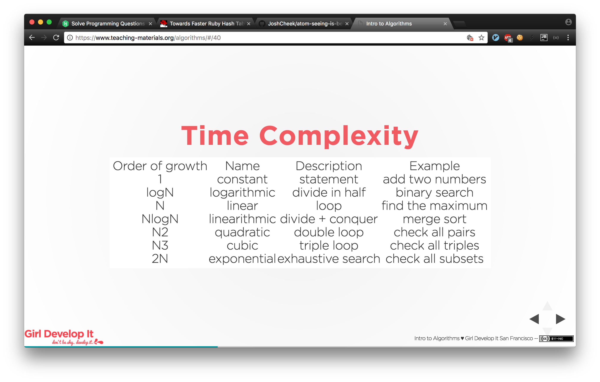
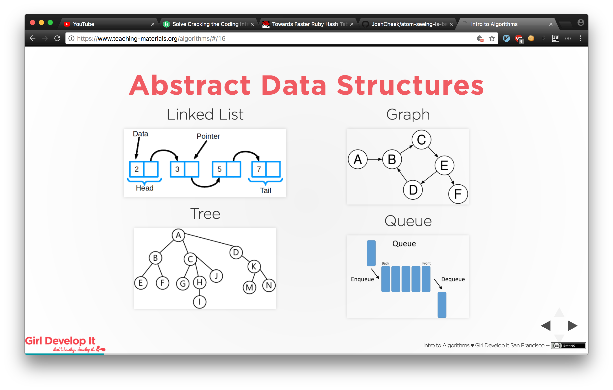

## **Data Structures and Algorithms:**
**Algorithm Complexity:**  You need to know basic **Big-O** and be able to analyze common algorithms.

research:
- [is Big-O for you](https://www.youtube.com/watch?v=-Yv2qljLrns)
- [Big-O (java)](https://www.youtube.com/watch?v=V6mKVRU1evU)
- [Intro to Algorithms](https://www.teaching-materials.org/algorithms/#/1)
- [Time Complexity](https://www.teaching-materials.org/algorithms/#/25)
- [Space Complexity](https://www.teaching-materials.org/algorithms/#/50)

ans: 
- 
- 

```html
    Big O is a measure of complexity: 
    How do you know if the algo is good?
    - Time Complexity: How long does the algorithm take?
    - Space Complexity: How much space does the algorithm use?
```
  
**Sorting:**  You should know the details of at least one n*log(n) sorting algorithm (merge sort).

research:

- [Array Sorting Algorithms](http://bigocheatsheet.com/)
- [Comparison of algorithms](https://en.wikipedia.org/wiki/Sorting_algorithm#Comparison_of_algorithms)
- [visualizer](https://visualgo.net/en/sorting)

ans:
- [**Sorting Algorithms**](http://www.sorting-algorithms.com/)
- [**Merge Sort**](data_structures_and_algorithms/07_merge_sort.rb) n*log(n)
- [**Bubble Sort**](data_structures_and_algorithms/05_bubble_sort.rb)
- [**Selection Sort**](data_structures_and_algorithms/06_selection_sort.rb)


**Linked List**

- [linked-List](data_structures_and_algorithms/10_data_struct_linked_list.rb)
- [Linked-list lab](data_structures_and_algorithms/linked_lists)

**Graphs:**  There are 3 basic ways to represent a graph in memory... 

1. Nodes as objects and edges as pointers
2. A matrix containing all edge weights between numbered node x and node y
3. An adjacency list of edges between numbered nodes
 
familiarize yourself with each representation and its pros & cons. 

[From stackOverflow:](https://stackoverflow.com/questions/3287003/three-ways-to-store-a-graph-in-memory-advantages-and-disadvantages) 


One way to analyze these is in terms of memory and time complexity (which depends on how you want to access the graph).

Storing nodes as objects with pointers to one another

The memory complexity for this approach is O(n) because you have as many objects as you have nodes. The number of pointers (to nodes) required is up to O(n^2) as each node object may contain pointers for up to n nodes.
The time complexity for this data structure is O(n) for accessing any given node.
Storing a matrix of edge weights

This would be a memory complexity of O(n^2) for the matrix.
The advantage with this data structure is that the time complexity to access any given node is O(1).
Depending on what algorithm you run on the graph and how many nodes there are, you'll have to choose a suitable representation.


- [Objects and pointers]()
	
	pros: 
	
	cons:
	
- [Adjacency Matrix and Adjacency List](http://www.geeksforgeeks.org/graph-and-its-representations/)

Adjacency List = An array of linked lists

  pros: Saves space O(|V|+|E|) . In the worst case, there can be C(V, 2) number of edges in a graph thus consuming O(V^2) space. 
  Adding a vertex is easier.

  cons: Queries like whether there is an edge from vertex u to vertex v are not efficient and can be done O(V).

You should know the basic graph traversal algorithms: breadth-first search and depth-first search. 
Know their computational complexity, their trade-offs, and how to implement them in real code.

note: to solve, you need to understand:

- [recursion](data_structures_and_algorithms/recursion)
- [stack](data_structures_and_algorithms/09_data_struct_stack.rb)
- [queue](data_structures_and_algorithms/08_data_struct_queue.rb)
- [hash-table](data_structures_and_algorithms/11_data_struct_hash_table.rb)
- [linked-List](data_structures_and_algorithms/10_data_struct_linked_list.rb)

research: 

- [**video 1**](https://www.youtube.com/watch?v=bIA8HEEUxZI&t=104s&list=PLz95RAb2ze2cornW3VaXSbzVtowrLHZLt&index=4)
- [**HackerRank video**](https://www.youtube.com/watch?v=zaBhtODEL0w)
- [**Discussion-ruby**](https://www.sitepoint.com/graph-algorithms-ruby/)
- [**Write-Up**](http://billleidy.com/blog/advent-of-code-and-graph-data-structure.html)
- [**RGL Gem**](https://www.blackbytes.info/2017/05/graph-theory-in-ruby/)

ans: 

- [**Graphs**](data_structures_and_algorithms/graphs.rb)

implement: create Binary tree creation class then use DFS and BFS as methods on it.

note: 
DFS recursive, simple but takes longer, need is-visited-flag
BFS better at finding shortest path

**Trees:**  NOTE: Trees are specialized versions of Graphs. 
Know about trees; basic tree construction, traversal and manipulation algorithms. 
Familiarize yourself with binary trees, n-ary trees, and trie-trees. 

- [binary trees](data_structures_and_algorithms/binary_tree)
- [trie-trees](https://www.youtube.com/watch?v=zIjfhVPRZCg)
- [n-ary trees](https://www.youtube.com/watch?v=jGElHK0jZAQ)

Be familiar with at least one type of [balanced binary tree](https://www.google.com/search?q=balanced+binary+tree&rlz=1C5CHFA_enUS731US731&oq=balanced+binary+tree&aqs=chrome..69i57j0l5.950j0j4&sourceid=chrome&ie=UTF-8). 
Understand tree traversal algorithms: BFS and DFS, and know the difference between **inorder, postorder and preorder**.

- [in-order](after hackerrank)
- [post-order](after HackerRank)
- [pre-order](after HackerRank)

**Other Data Structures and Algorithms:**  Know how to write a hash table. Know basic sampling techniques and binary search.  

ans: 

- [**Binary search recursive**](data_structures_and_algorithms/04_binary_search_recursive.rb) 
- [**Binary search iterative**](data_structures_and_algorithms/02_binary_search.rb)
- [**Hash Table video**](https://www.youtube.com/watch?v=h2d9b_nEzoA)
- [**Hash Table example**](https://gist.github.com/arjans/db79d5ba3b644fd41b197a882b2b5ee1)

**Optimizations** Be prepared to discuss different ways to optimize your Algorithm. Making an Algorithm take less time or space.

ans:
- Experiment with different sort types

**Mathematics:**  Basic knowledge of counting problems, probability problems, and other Discrete Math 101 situations. 
Spend some time before the interview refreshing your memory on (or teaching yourself) the essentials of combinatorics 
and probability. You should be familiar with n-choose-k problems and their ilk.

ans:
 - [**n-choose-k**](data_structures_and_algorithms/12_n-choose-k.rb)
 
### RESOURCES:
 
 - [Book: Programing Problems in Ruby interview](https://www.amazon.com/Programming-Problems-Ruby-Bradley-Green-ebook/dp/B00EPQ4R6S/ref=pd_sim_351_1?_encoding=UTF8&psc=1&refRID=1H4PE8E07VK9NG1DGW3M)
 - [codewars](https://www.codewars.com/?language=ruby)
 - [Intro to Algorithms](https://www.teaching-materials.org/algorithms/#/1)
 - [Khan Academy](https://www.khanacademy.org/computing/computer-science/algorithms)
 
### [Abstract Data Structures Overview:](https://www.teaching-materials.org/algorithms/#/16)
 
 
 
 - Linked-list
 - Graph
 - Tree
 - queue

 